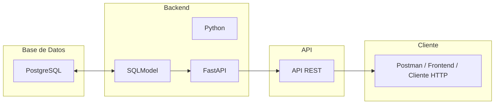

# 📦 Backend - Trazabilidad de Datos

Este proyecto expone una API REST para consultar información almacenada en una base de datos PostgreSQL. Está desarrollado con **FastAPI** y utiliza **SQLModel** como ORM. El objetivo principal es permitir trazabilidad de datos desde una base relacional hasta endpoints fácilmente consumibles.

---

## 🔄 Diagrama de flujo de la trazabilidad de datos




---

## 📁 Estructura del Proyecto

```bash
.
├── app/
│   ├── core/              # Configuración y conexión a la base de datos
│   │   ├── config.py
│   │   └── database.py
│   ├── domain/            # Modelos de datos (SQLModel)
│   │   └── producto_politica.py
│   ├── routers/           # Endpoints de la API
│   │   └── producto_politica.py
│   ├── main.py            # Punto de entrada de la API
├── requirements.txt
└── README.md
```
## 📁 Estructura del Proyecto

### 🧠 `app/core/database.py`
📌 **¿Qué hace?**

- Crea la conexión al motor de base de datos PostgreSQL.
- Usa `SQLModel` y `create_engine`.
- Aplica `search_path` para que las consultas usen el esquema `odp`.

---

### ⚙️ `app/core/config.py`
📌 **¿Qué hace?**

- Define las variables de entorno necesarias para conectarse a la base de datos.
- Centraliza la configuración del proyecto usando `pydantic.BaseSettings`.

---

### 🧠 `app/domain/models/producto_politica.py`
📌 **¿Qué hace?**

- Define la entidad de dominio `ProductoPolitica` según reglas del negocio.
- Es independiente del motor de base de datos y representa el concepto puro del dominio.

---


### 📐 `app/domain/schemas/producto_politica.py`
📌 **¿Qué hace?**

- Define los modelos de entrada/salida (DTOs) para la API usando `Pydantic`.
- Asegura validación de datos en las requests/responses.
- Separa el modelo de dominio del modelo expuesto por la API.

---

### 🧩 `app/application/routers/producto_politica.py`
📌 **¿Qué hace?**

- Expone los endpoints para consultar los datos de `producto_politica`.
- Usa inyección de dependencias para acceder a la sesión de la base de datos.

---

### 🚀 `main.py`
📌 **¿Qué hace?**

- Inicia la aplicación FastAPI.
- Incluye los routers que exponen las rutas de la API.

---

### 📦 `requirements.txt`
📌 **¿Qué hace?**

- Define las dependencias necesarias para instalar y correr el proyecto.

---

## ⚙️ Requisitos

- Python 3.10+
- PostgreSQL
- `virtualenv` o `pipenv`
- FastAPI, SQLModel, psycopg2

---

## 🚀 Instalación y Ejecución

```bash
# Crear entorno virtual
python -m venv .venv
source .venv/bin/activate  # En Windows: .venv\Scripts\activate

# Instalar dependencias
pip install -r requirements.txt

# Ejecutar la API
uvicorn app.main:app --reload
```

---

## 🔐 Variables de Entorno

Crear un archivo `.env` con:

```env
DB_USER=usuario
DB_PASSWORD=contraseña
DB_HOST=localhost
DB_PORT=5432
DB_NAME=nombre_basededatos
DB_SCHEMA=odp
```

La configuración se carga automáticamente desde `app/core/config.py`.

---

## 🧠 Arquitectura

Este proyecto sigue una **arquitectura inspirada en hexagonal**, separando claramente:

- **Infraestructura (core)**: conexión y configuración.
- **Dominio**: modelos que representan tus tablas.
- **Aplicación (routers)**: lógica y exposición de endpoints.

---

## 📡 Endpoints

Una vez ejecutada la API, accedé a la documentación en:

- Swagger UI: [http://localhost:8000/docs](http://localhost:8000/docs)
- ReDoc: [http://localhost:8000/redoc](http://localhost:8000/redoc)

